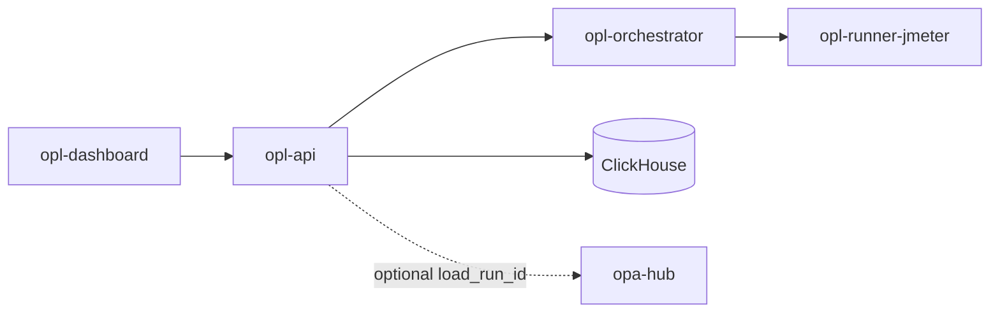

# Architecture

`opl-api` owns load-test control-plane APIs. `opl-orchestrator` schedules ephemeral `opl-runner-jmeter` containers for runs (one container per load run).

## Containers

| Image | Role |
|-------|------|
| `opl-api` | Control plane (`:8092`) |
| `opl-orchestrator` | Same binary, `orchestrator` command |
| `opl-runner-jmeter` | Ephemeral JMeter/load runner |

Image tags: `*:smoke` (laptop) · `*:nas` (production / NAS only).

## Optional micro-services

Phase 3 may introduce `opl-gateway` in front of pealed run/scenario services. Until then all routes live on `opl-api`. See [microservices.md](microservices.md).
