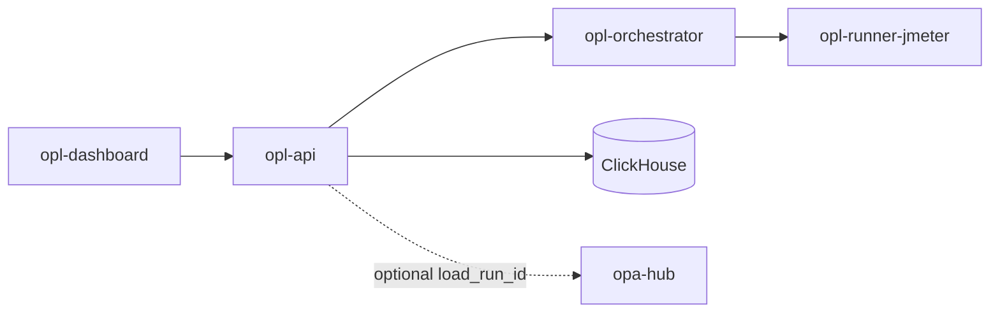

# Architecture

`opl-api` owns load-test control-plane APIs. `opl-orchestrator` schedules ephemeral `opl-runner-jmeter` containers for runs.

```mermaid
flowchart LR
  UI[opl-dashboard] --> API[opl-api]
  API --> Orch[opl-orchestrator]
  Orch --> Runner[opl-runner-jmeter]
  API --> CH[(ClickHouse)]
  API -.->|optional load_run_id| Hub[opa-hub]
```
