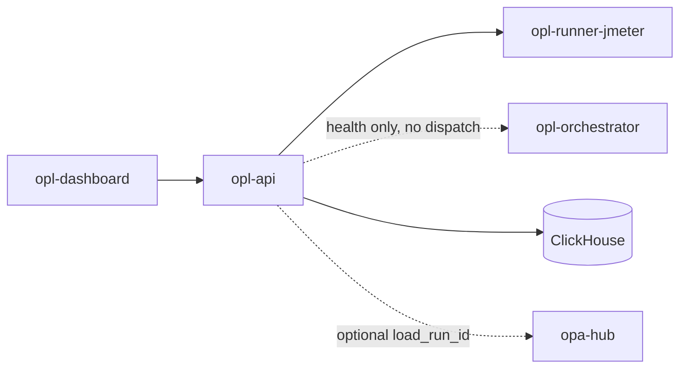

# Architecture

`opl-api` owns load-test control-plane APIs **and dispatches the run containers itself**.

`opl-orchestrator` is currently a health endpoint, not a scheduler: `opl_orchestrator.go` registers only
`/api/health` (`:14`) and contains no dispatch, queue, or reaper logic. Container start-up happens inside
`opl-api` (`jmeter_engine.go` → `PerfContainerRunner`), and the schedule tick runs in-process there too
(`main.go:30` → `lab_extras.go:283`). Read the service name as a target shape, not current behaviour.

## Containers

| Image | Role |
|-------|------|
| `opl-api` | Control plane (`:8092`) — also dispatches run containers and runs the schedule tick |
| `opl-orchestrator` | Same binary, `orchestrator` command — `/api/health` only, no dispatch logic |
| `opl-runner-jmeter` | Ephemeral JMeter/load runner |

Image tags: `*:smoke` (laptop) · `*:nas` (production / NAS only).

## Optional micro-services

Phase 3 may introduce `opl-gateway` in front of pealed run/scenario services. Until then all routes live on `opl-api`. See [microservices.md](microservices.md).
