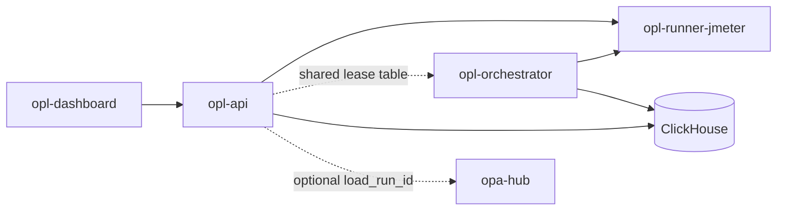

# Architecture

`opl-api` owns load-test control-plane APIs **and dispatches the run containers itself**.

`opl-orchestrator` now dispatches scheduled runs and reaps finished ones. It runs the same schedule tick as
`opl-api` and shares the lease table with it, so both may run at once: whichever process wins an occurrence's
lease fires it and the other stands down. Container start-up still happens inside `opl-api`
(`jmeter_engine.go` → `PerfContainerRunner`); the orchestrator drives that same dispatch path, it does not own
a separate runner. What it does **not** yet have: a work queue, priorities, or any placement decision beyond
"fire the schedule that is due".

## Containers

| Image | Role |
|-------|------|
| `opl-api` | Control plane (`:8092`) — also dispatches run containers and runs the schedule tick |
| `opl-orchestrator` | Same binary, `orchestrator` command (`:8097`) — leased schedule dispatch + run reaper |
| `opl-runner-jmeter` | Ephemeral JMeter/load runner |

Image tags: `*:smoke` (laptop) · `*:nas` (production / NAS only).

## Schedule leasing

ClickHouse has no compare-and-set, so a scheduled occurrence is leased by **insert, settle, arbitrate**:

1. every contender appends a claim row to `load_schedule_leases` for the occurrence's `fire_key`;
2. it waits out a settle window (`OPL_SCHEDULER_LEASE_SETTLE_MS`, default 2000);
3. it reads the whole claim set back and accepts the winner under a total order — earliest claim first,
   lowest owner id as tie-break.

Every contender therefore elects the same owner without talking to any other contender. The settle window is
load-bearing, not a retry delay: without it two contenders stamping the same millisecond can each read a claim
set in which they are the minimum — the first because the second's row is not yet inserted, the second because
it sorts lower on owner — and both fire.

**What this guarantees:** single-fire under bounded insert skew. **What it does not:** a linearizable lock. If
two replicas' claims for one occurrence were separated by more than the settle window *and* stamped the same
millisecond by skewed clocks, both could fire. Keep the settle window well above real insert latency and keep
replica clocks in sync. `load_schedule_leases` records every claim, winning or losing, so a double fire is
detectable after the fact rather than invisible.

The owner identity is per-process, so two schedule loops **inside one process** would each see the lease as
their own. `startPerfScheduler` enforces one loop per process with a `sync.Once`; the orchestrator's loop is a
separate process.

`fire_key` names one occurrence and must be identical across replicas, so it is derived from the persisted next
fire time or the schedule definition — never from a wall-clock timestamp, which would never collide and so
never arbitrate.

## Optional micro-services

Phase 3 may introduce `opl-gateway` in front of pealed run/scenario services. Until then all routes live on `opl-api`. See [microservices.md](microservices.md).
